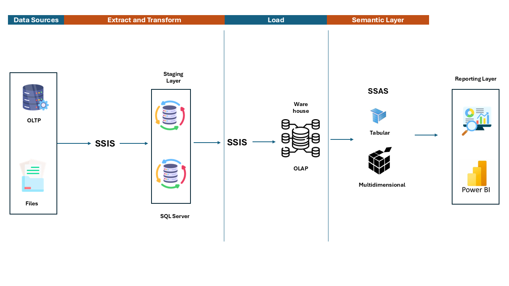

# Data Warehousing: ETL Pipeline with SSIS, SQL Server, SSAS, and Power BI



## 📝 Overview

This project demonstrates a complete implementation of ETL pipeline using **SQL Server Integration Services (SSIS)**, **SQL Server**, **SQL Server Analysis Services (SSAS)**, and **Power BI** for reporting and data visualization. The architecture follows a standard Extract, Transform, Load (ETL) process and a multidimensional data model for analytical processing.

## 🏗️ Architecture

### 🗄️ Data Sources
- **OLTP Databases**: Transactional data from operational systems.
- **Files**: Flat files such as CSV, Excel, etc.

### 🔄 ETL Process
- **Extract and Transform**: Implemented using SSIS to extract data from OLTP and files, load it into the staging area in SQL Server, and then also used to transform the data for ingestion into the warehouse.
- **Load**: Further ETL operations to move data from the staging area to the data warehouse (DW) and OLAP cubes.

### 💾 Data Storage
- **Staging Layer**: Temporary storage for raw data before final transformation.
- **Data Warehouse**: Central repository for integrated data from multiple sources.
- **OLAP (Online Analytical Processing)**: Multidimensional storage for analytical processing.

### 📊 Semantic Layer
- **SSAS**: Used to create Tabular and Multidimensional models for complex analytical queries.

### 📈 Reporting Layer
- **Power BI**: Visualization tool for creating interactive reports and dashboards from SSAS models.

## 🛠️ Setup Instructions

### Prerequisites
- SQL Server with Integration Services and Analysis Services installed.
- Power BI Desktop.
- Source data (OLTP databases, flat files).

### Steps

1. **Clone the Repository**:
   ```sh
   git clone https://github.com/your-username/your-repo.git
   cd your-repo
